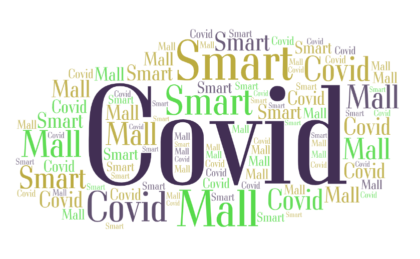
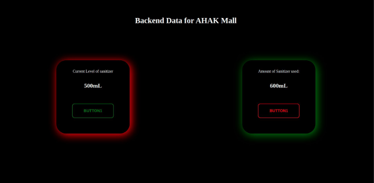
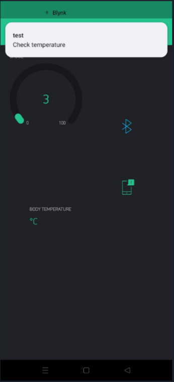
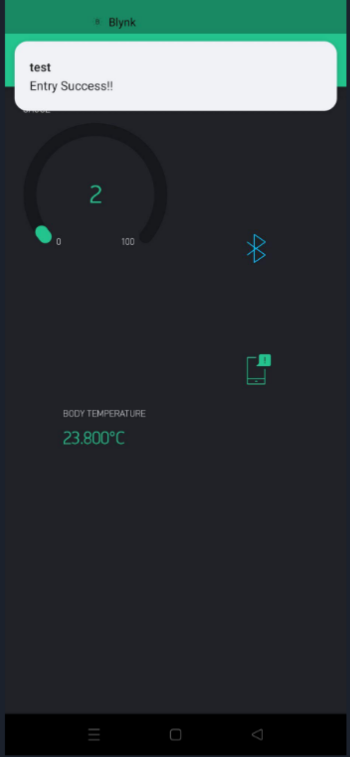
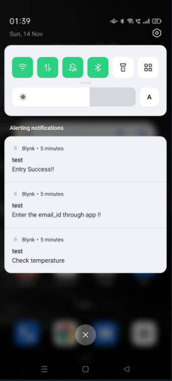

# Covid Smart Mall

        
### An IoT based solution for implementing the Covid Guidelines 

### Key Features : 
  
1. **Controlled Exit and Entry** : 

   1. The mall has smart sensors - 
      1. **Servo Motor** : Facilitating the no contact entry and exit for the customers
      2. **PIR Sensor** : For detecting the motion at the entry/exit gates of the mall , to keep a check on count of the number of people present in the mall
      3. **DHT-11** : For checking the body temperature , and entry being allowed if the temperatire is lower than a certain threshold value
     

2. **Smart Handwash Dispenser** :
   
   Besides this , there we have **smart handwash** dispensor , that involves a **servo motor** and **PIR** sensor , for contactless sanitizer dispensing ( 100 ml at each dispense ).
     
   1. There is a website , that shows the amount of sanitizer left in the dispenser. and alerts in case the amount of sanitizer goes below a certain threshold , so that it can be refilled by the authorities.
    
         
        
   

3. **Max Capacity** : 

    1. At any given time, a max of **100** people could be present inside the mall and thus avoiding the excessive crowding inside the mall and thus preventing the spread of covid.
4. **Blynk Application** :
   1. The mall had a blynk application , that facilitates contact-less entry of persons into the mall.
   2. The blynk app asks users for their details ( email id and name ) for storing in their data base for facilitating the easy **contact tracing** in case of an outbreak.
   3. The app takes through the user through various steps and finally entering the mall once all the guidelines are met :
      1. **temperature** : prompts user to give temperature reading at the entry gate , proceeds further iff temperature is below a certain threshold else , the entry is denied.

         
      
      2. **Count** : after this , the number of people already in the mall are checked , and entry is allowed iff the count is strictly less than the maximum threshold value.
        
            
            
        

4. **One M2M integration**
   1. Uploaded and stored visitor's data ( name , temperature , etc. ) on OneM2M server 